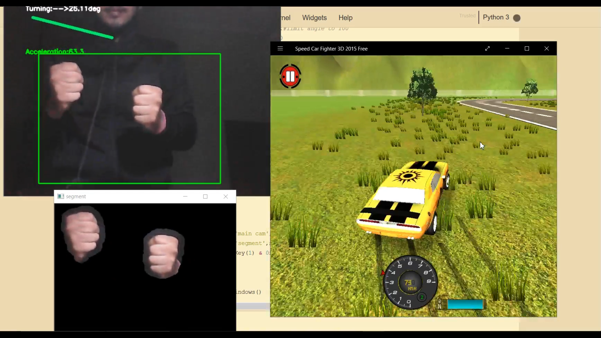

# Game_Control_Using_OpenCV
Control the acceleration , turning  , and braking of the vehicle in a racing game through your fists gestures.
The project makes use of the pythons OpenCV library to capture live video and process the frames to simulate suitable keypress
You can turn the car right or left by turning the combinations of your fists in left or right directions respectively as if you are holding a virtual steering wheel.

The project includes turning left , turning right , moving forward , and applying brakes(moving backwards).

